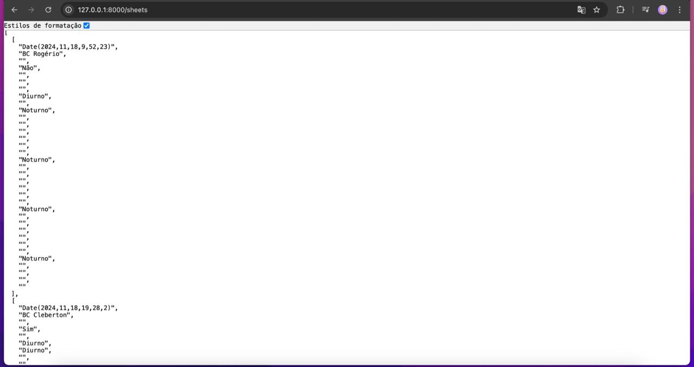

# Obtendo os Dados da Planilha

## Focando em Obter os Dados
De forma simples, como o Paulo solicitou, obtemos os dados em formato de array. Veja:

Acredito que, mais tarde, organizaremos os dados diretamente na planilha B. 

